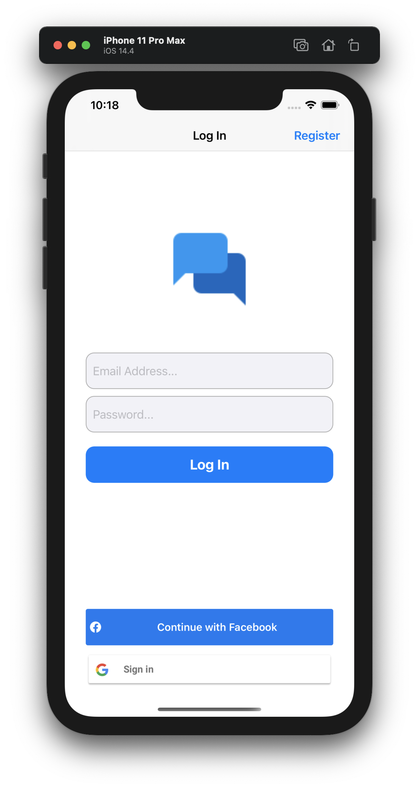
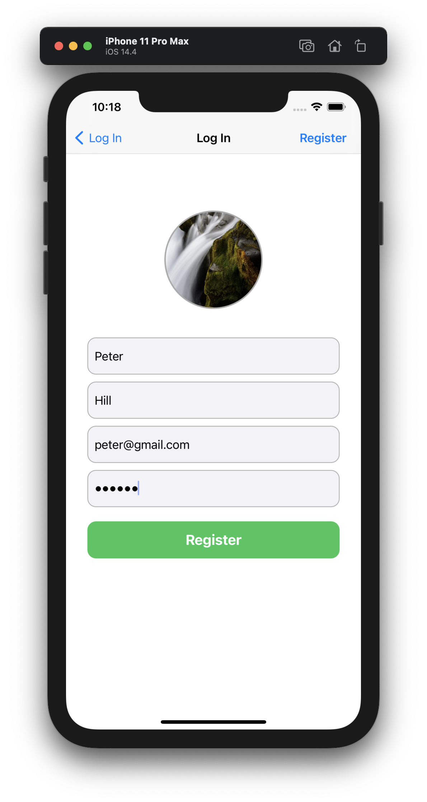
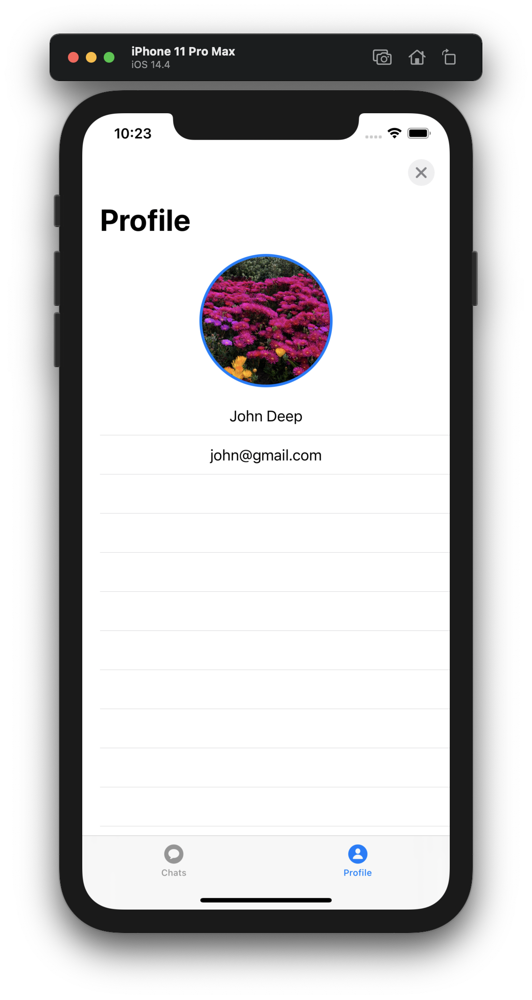
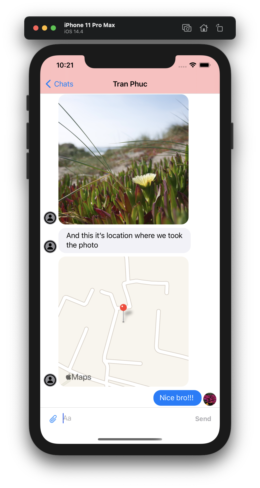
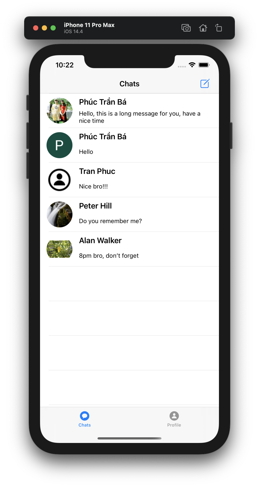
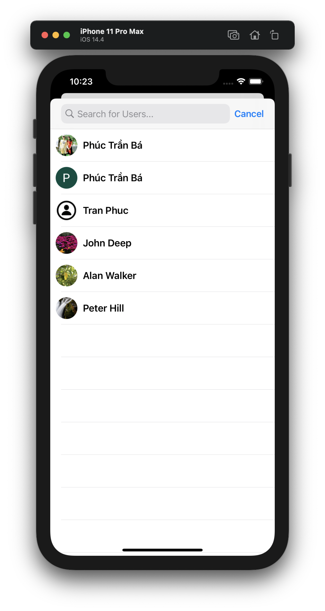

# Easy chat

Simple real time chat application in Swift 5 using Firebase - Practice with iOS

## Features 
* Facebook Log In
* Google Sign In
* Email/Pass Registration / Log In
* Photo Messages
* Video Messages
* Real Time Conversations
* Location Messages
* Search for Users
* Deleting Conversations
* User Profile
* Dark Mode Support

## Libraries
* [Firebase](https://firebase.google.com/)
* [FBSDKLoginKit](https://cocoapods.org/pods/FBSDKLoginKit)
* [GoogleSignIn](https://cocoapods.org/pods/GoogleSignIn)
* [MessageKit](https://github.com/MessageKit/MessageKit)
* [JGProgressHUD](https://github.com/JonasGessner/JGProgressHUD)
* [RealmSwift](https://github.com/realm/realm-cocoa)
* [SDWebImage](https://github.com/SDWebImage/SDWebImage)

## Screen Shot
|  |  |  |
| - | - | - |
|  |  |  |

## Development team
* [Phuc Tran Ba](https://github.com/phuctranba)

## Development purpose
Personal projects for practice
